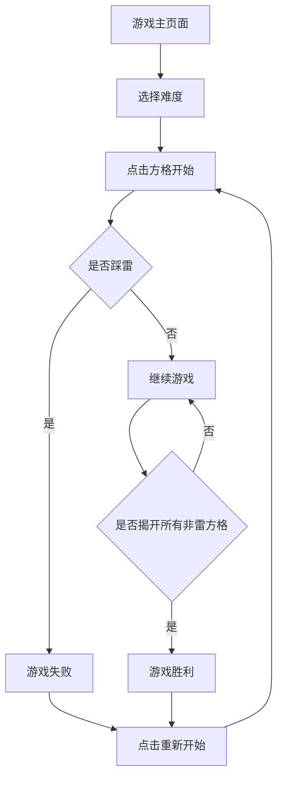

## 1. 产品概述

经典扫雷游戏网页版，复刻Windows传统玩法。用户通过逻辑推理标记地雷，锻炼思维能力。

* 目标用户：喜欢益智游戏的各年龄段用户

* 产品价值：提供随时可玩的逻辑推理游戏，无需安装

## 2. 核心功能

### 2.1 用户角色

无需用户系统，单机游戏模式

### 2.2 功能模块

扫雷游戏包含以下核心页面：

1. **游戏主页面**：雷区网格、游戏状态栏、难度选择、计时器、剩余地雷计数

### 2.3 页面详情

| 页面名称  | 模块名称    | 功能描述                                    |
| ----- | ------- | --------------------------------------- |
| 游戏主页面 | 雷区网格    | 显示9×9/16×16/16×30的方格，左键揭开、右键标记/取消标记地雷   |
| 游戏主页面 | 顶部状态栏   | 显示剩余地雷数、游戏时间、重新开始按钮                     |
| 游戏主页面 | 难度选择    | 初级(9×9,10雷)/中级(16×16,40雷)/高级(16×30,99雷) |
| 游戏主页面 | 游戏控制    | 左键揭开方格、右键标记地雷、双击快速揭开相邻方格                |
| 游戏主页面 | 胜利/失败提示 | 游戏结束时显示结果，可重新开始                         |

## 3. 核心流程

用户进入游戏页面 → 选择难度 → 点击方格开始游戏 → 根据数字提示推理地雷位置 → 右键标记地雷 → 揭开所有非雷方格获胜/踩雷失败 → 重新开始

## 4. 用户界面设计

### 4.1 设计风格

* 主色调：经典扫雷灰色系(#C0C0C0为主背景)

* 按钮样式：3D凸起效果，点击时有凹陷视觉反馈

* 字体：等宽字体显示数字，微软雅黑用于界面文字

* 布局：顶部状态栏+中央雷区的经典布局

* 图标：使用SVG绘制地雷、旗帜、问号等图标

### 4.2 页面设计概述

| 页面名称  | 模块名称 | UI元素                                      |
| ----- | ---- | ----------------------------------------- |
| 游戏主页面 | 雷区网格 | 方格大小20×20px，边框3D效果，数字颜色：1蓝2绿3红4深蓝5棕6青7黑8灰 |
| 游戏主页面 | 状态栏  | 高度40px，包含地雷计数器(红色LED数字)、笑脸按钮、计时器          |
| 游戏主页面 | 难度选择 | 下拉菜单或按钮组，当前选中状态高亮显示                       |

### 4.3 响应式设计

* 桌面端优先设计，基础尺寸适配1024×768以上分辨率

* 移动端适配：方格大小根据屏幕宽度自适应，最小触摸目标44×44px

* 横竖屏切换时保持游戏状态，自动调整布局

