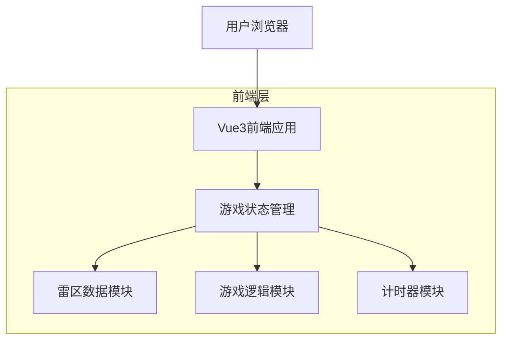

## 1. 架构设计



## 2. 技术栈描述

- 前端：Vue3@3.4 + TypeScript@5 + Tailwind CSS@3
- 初始化工具：vite-init
- 后端：无（纯前端应用）

## 3. 路由定义

| 路由 | 用途 |
|------|------|
| / | 游戏主页面，显示扫雷游戏界面 |
| /about | 关于页面，显示游戏说明和制作信息（可选） |

## 4. 核心数据结构

### 4.1 游戏状态类型定义

```typescript
// 方格状态枚举
enum CellState {
  Hidden = 'hidden',      // 未揭开
  Revealed = 'revealed',   // 已揭开
  Flagged = 'flagged',     // 已标记
  Questioned = 'questioned' // 标记问号
}

// 方格内容枚举
enum CellContent {
  Empty = 0,      // 空白
  Mine = -1,      // 地雷
  Number1 = 1,    // 数字1-8
  Number2 = 2,
  Number3 = 3,
  Number4 = 4,
  Number5 = 5,
  Number6 = 6,
  Number7 = 7,
  Number8 = 8
}

// 单个方格接口
interface Cell {
  state: CellState
  content: CellContent
  isMine: boolean
  adjacentMines: number
}

// 游戏难度配置
interface GameDifficulty {
  name: string
  rows: number
  cols: number
  mines: number
}

// 游戏状态接口
interface GameState {
  board: Cell[][]
  difficulty: GameDifficulty
  gameStatus: 'ready' | 'playing' | 'won' | 'lost'
  timeElapsed: number
  minesRemaining: number
  cellsRevealed: number
}
```

### 4.2 关键模块设计

**雷区生成模块**
- 随机布雷算法：确保第一次点击不踩雷
- 数字计算：根据地雷位置计算每个方格相邻地雷数

**游戏逻辑模块**
- 方格揭开：处理连锁揭开空白区域
- 胜利判定：所有非雷方格被揭开
- 失败判定：点击到地雷

**状态管理模块**
- 使用Vue3 Composition API管理游戏状态
- 提供游戏重置、难度切换等方法

## 5. SVG图标方案

所有图标使用内联SVG实现，避免外部资源依赖：

```svg
<!-- 地雷图标 -->
<svg width="16" height="16" viewBox="0 0 16 16">
  <circle cx="8" cy="8" r="6" fill="#333"/>
  <line x1="8" y1="2" x2="8" y2="14" stroke="#666" stroke-width="1"/>
  <line x1="2" y1="8" x2="14" y2="8" stroke="#666" stroke-width="1"/>
</svg>

<!-- 旗帜图标 -->
<svg width="16" height="16" viewBox="0 0 16 16">
  <rect x="2" y="2" width="1" height="12" fill="#8B4513"/>
  <polygon points="3,2 12,5 3,8" fill="#FF0000"/>
</svg>
```

## 6. 性能优化

- 使用`v-memo`缓存方格组件渲染
- 大棋盘采用虚拟滚动技术
- 游戏逻辑计算使用Web Worker避免阻塞UI
- 移动端触摸事件优化，防止300ms延迟